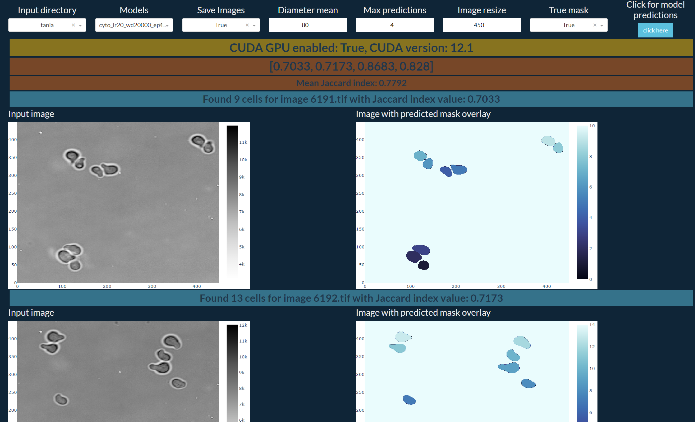
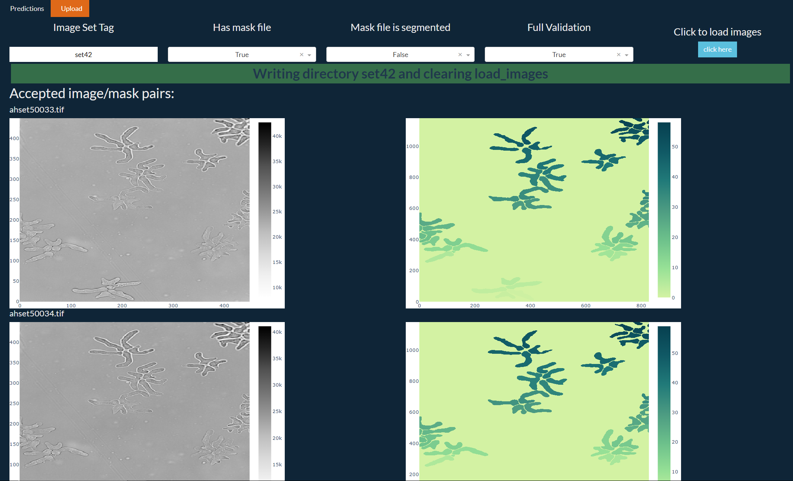

### CITATION

**If you use Cellpose 1 or 2, please cite the Cellpose 1.0 [paper](https://t.co/kBMXmPp3Yn?amp=1):**  
Stringer, C., Wang, T., Michaelos, M., & Pachitariu, M. (2021). Cellpose: a generalist algorithm for cellular segmentation. <em>Nature methods, 18</em>(1), 100-106.

**If you use the new human-in-the-loop training, please also cite the Cellpose 2.0 [paper](https://www.nature.com/articles/s41592-022-01663-4):**  
Pachitariu, M. & Stringer, C. (2022). Cellpose 2.0: how to train your own model. <em>Nature methods</em>, 1-8.

**If you use the restoration models, please also cite the Cellpose3 [paper](https://www.biorxiv.org/content/10.1101/2024.02.10.579780v1):**
Stringer, C. & Pachitariu, M. (2024). Cellpose3: one-click image restoration for improved segmentation. <em>bioRxiv</em>.

# Predictions page
Predict a segmented mask for a set of images


# Upload page
Add image sets for training models, creating new masks, or out-of-sample testing 


## Enable Nvidia runtime inside docker containers 
- Open Docker -> settings -> docker engine 
```json
{
  "builder": {
    "gc": {
      "defaultKeepStorage": "20GB",
      "enabled": true
    }
  },
  "experimental": false,
  "features": {
    "buildkit": true
  },
  "default-runtime": "nvidia",
  "runtimes": {
    "nvidia": {
      "path": "nvidia-container-runtime",
      "runtimeArgs": []
    }
  }
}