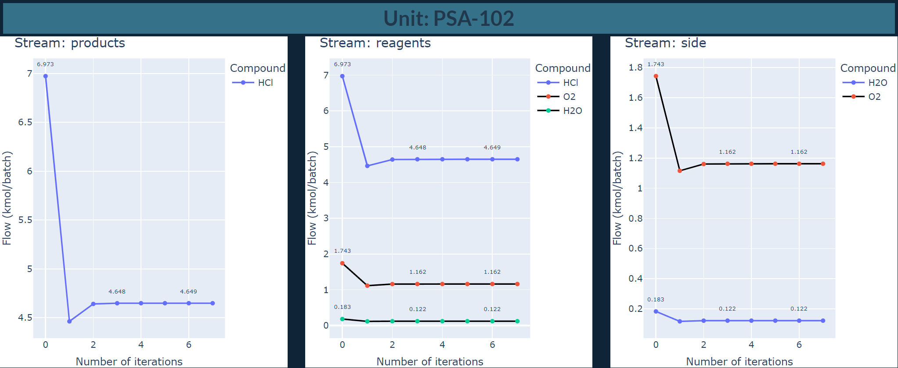

# Basic implementation of a chemical process simulator using [Thermo](https://thermo.readthedocs.io/index.html#) and [ChemPy](https://bjodah.github.io/chempy/latest/)


## Simulate chemical processes by writing a [config file](https://github.com/hunterviolette/24spring/blob/main/che_capstone/cfg.json)
- Converges all flows to steady state from "Basis" key in [cfg.json](https://github.com/hunterviolette/24spring/blob/main/che_capstone/cfg.json)
- Overall heat duty calculation for reactors: ```Q (kJ/mol) = enthalpy_streams_out - enthalpy_streams_in + heat_of_reaction ```
- The ground-work for equation of state calculations for pump/compressors, heat exchangers, and flashes using Thermo is mostly complete but not integrated currently

## Process Flow Diagrams (PFD)
### Overall PFD


### Simulated PFD


### First Pass Unit Flows 


### Steady State Unit Flows


### Steady State Material Balance

- MgCl2 is in balance with N2 and NH3 but not with O2 and H2O due to HCl recycle in R-103.
- H2O is in balance with O2, ensuring overall material balance conservation.

# Generated by [app.py](https://github.com/hunterviolette/24spring/blob/main/che_capstone/app.py)





### Profitability vs Economy of Scale


### Unit Flows per Iteration (main.py)
