# Basic implementation of a chemical process simulator using [Thermo](https://thermo.readthedocs.io/index.html#) and [ChemPy](https://bjodah.github.io/chempy/latest/)
- Simulate chemical processes by writing a [config file](https://github.com/hunterviolette/24spring/blob/main/che_capstone/cfg.json)

## Simulator Classes
1. [balance.py](https://github.com/hunterviolette/24spring/blob/main/che_capstone/src/balance.py): Generate material balance to generate initial flow rates for basis components

2. [core.py](https://github.com/hunterviolette/24spring/blob/main/che_capstone/src/core.py): Backbone of simulator. Iterates over current and previous state to determine inlet and outlet flows of unit operations. 

3. [steady_state.py](https://github.com/hunterviolette/24spring/blob/main/che_capstone/src/steady_state.py): Iterates over core, attempts convergence of flows at steady-state. If flows converge, iterate over starting flows until steady-state flow converges to steady-state set-point. 

4. [thermal.py](https://github.com/hunterviolette/24spring/blob/main/che_capstone/src/thermal.py): Thermodynamic calculations of temperature and pressure dependent mixtures using equations of state to calculate heat of reaction, overall heat duty for adiabatic operation of reactors, and utility requirement of unit operations. 

5. [unit_registry.py](https://github.com/hunterviolette/24spring/blob/main/che_capstone/src/unit_registry.py): Base class inherited for dimensional calculations. 

## Process Flow Diagrams (PFD)
### Overall PFD
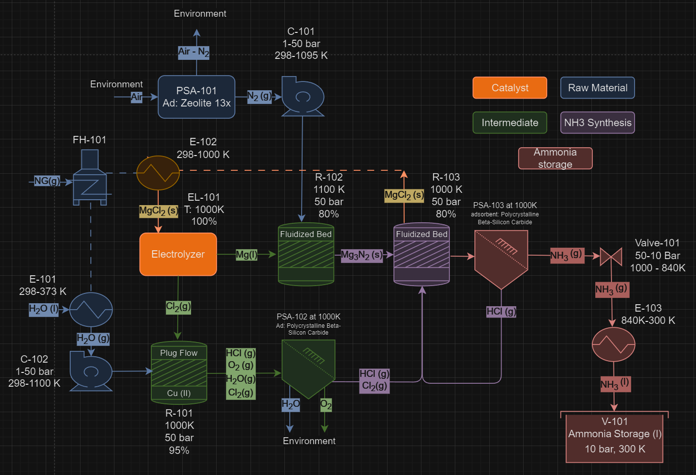

### Simulated PFD
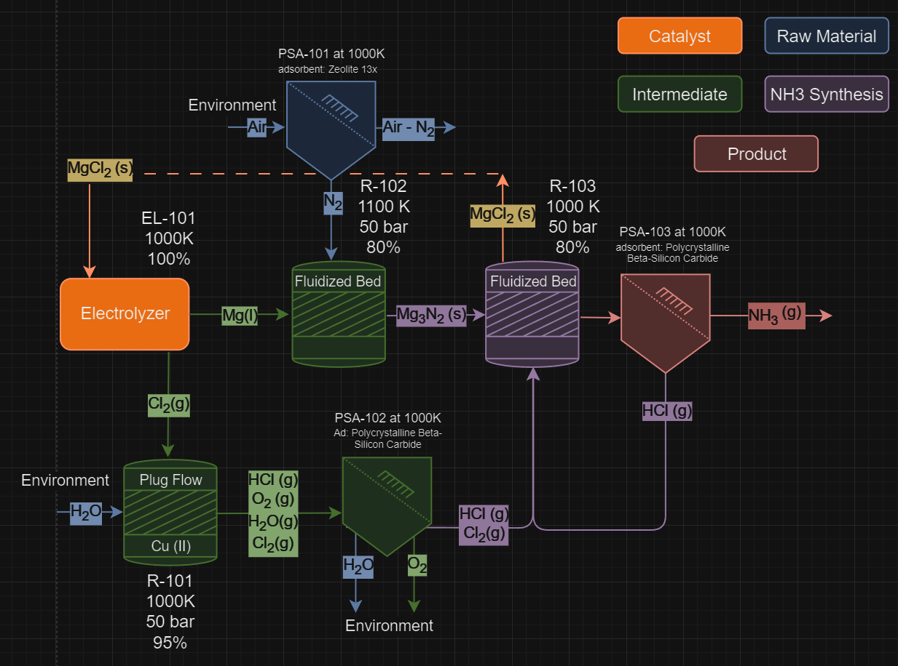

### First Pass Unit Flows 
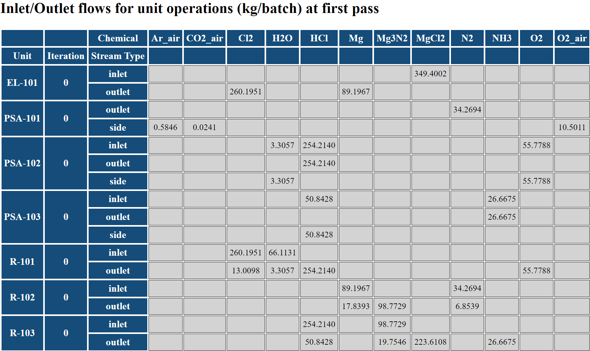

### Steady State Unit Flows

### Steady State Material Balance
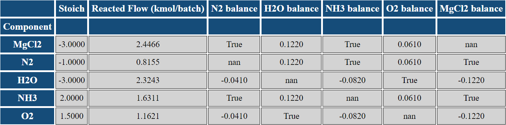
- MgCl2 is in balance with N2 and NH3 but not with O2 and H2O due to HCl recycle in R-103.
- H2O is in balance with O2, ensuring overall material balance conservation.

# Generated by [app.py](https://github.com/hunterviolette/24spring/blob/main/che_capstone/app.py)

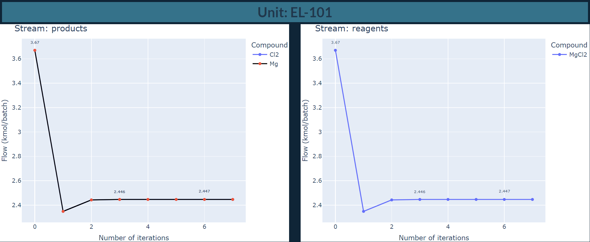

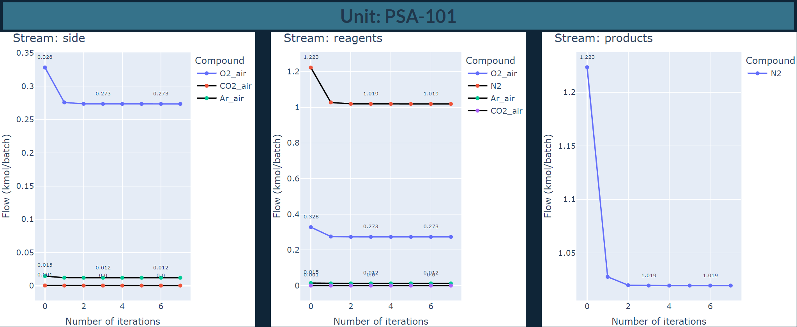

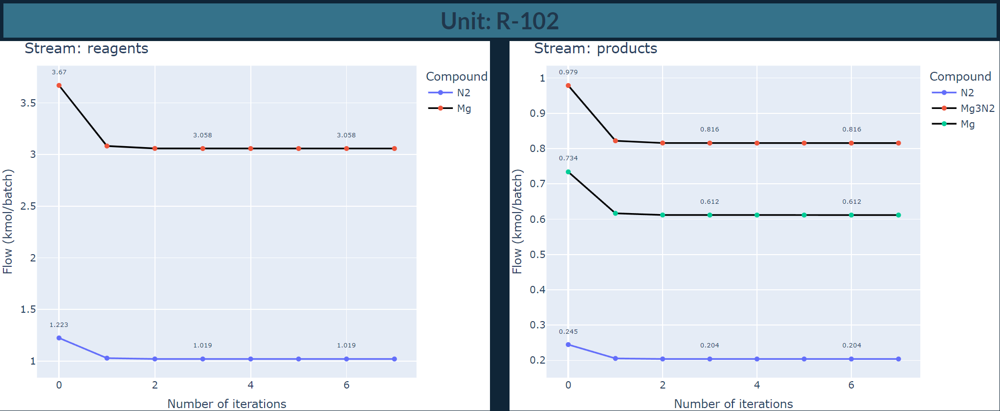

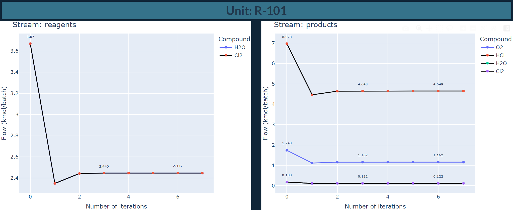

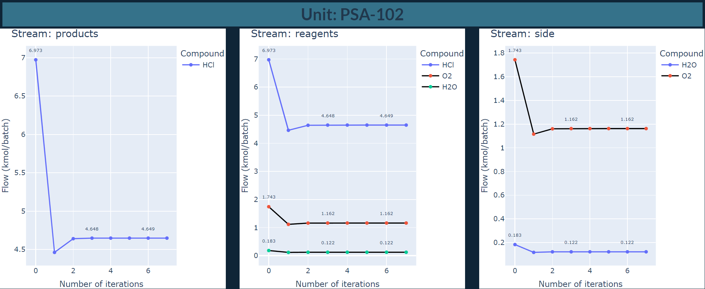

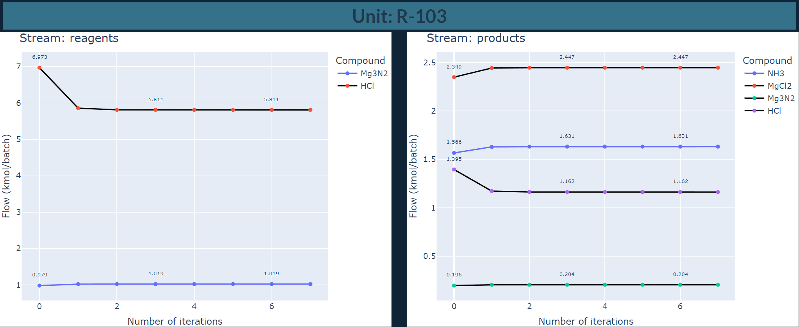

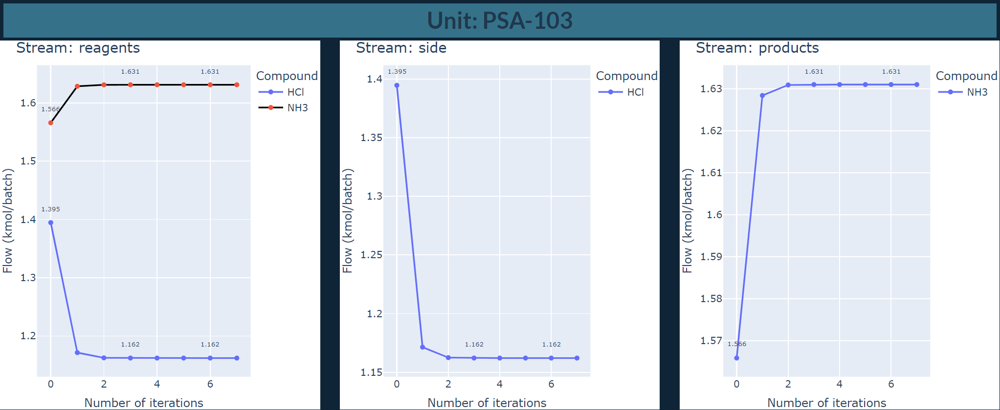

### Profitability vs Economy of Scale
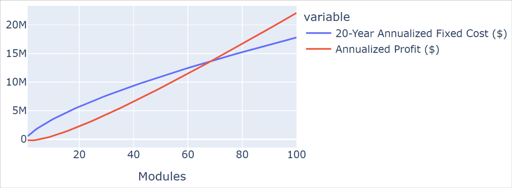

### Unit Flows per Iteration (main.py)
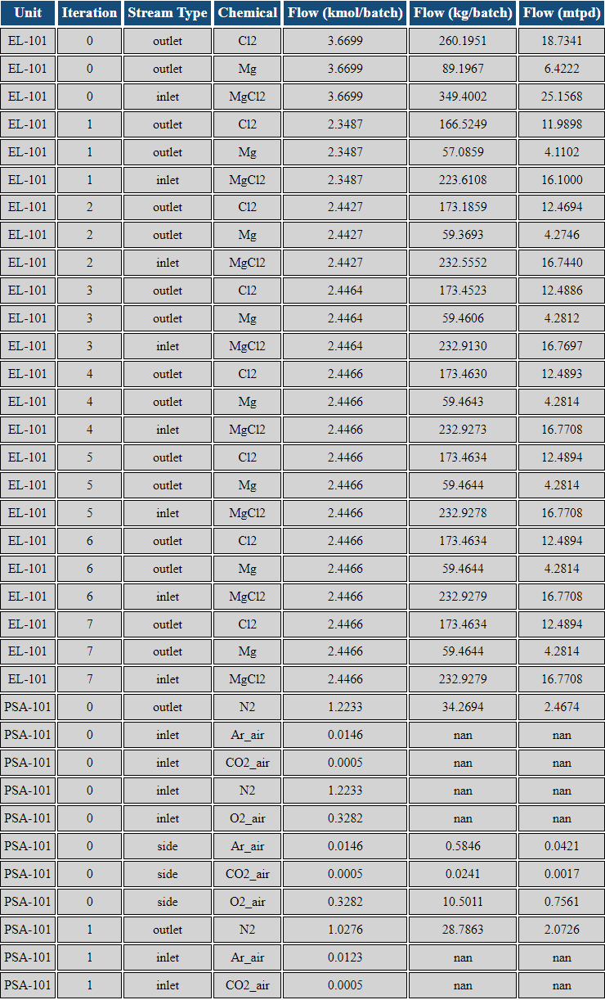