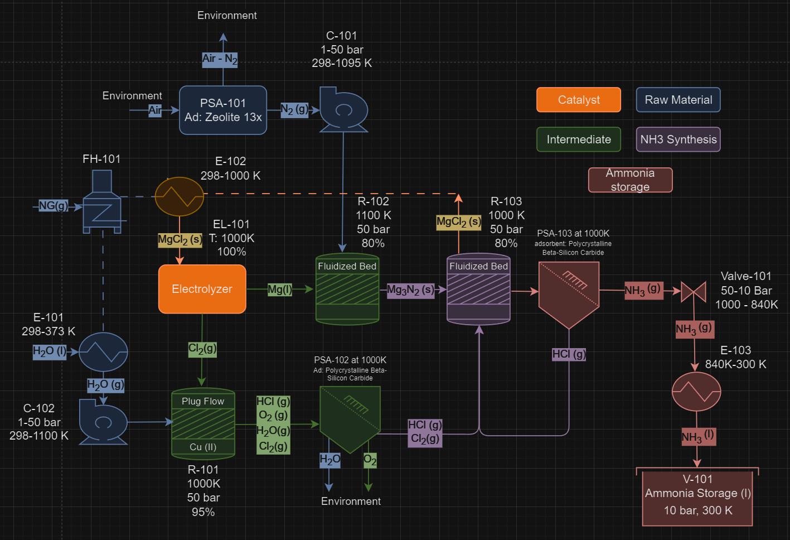
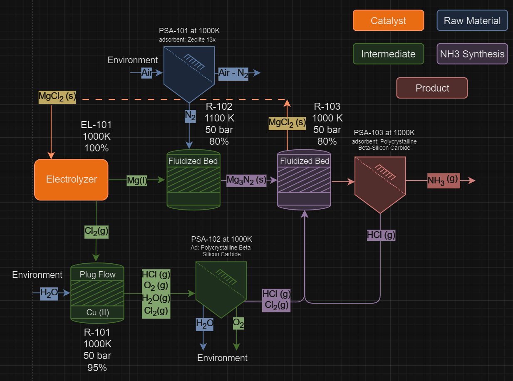
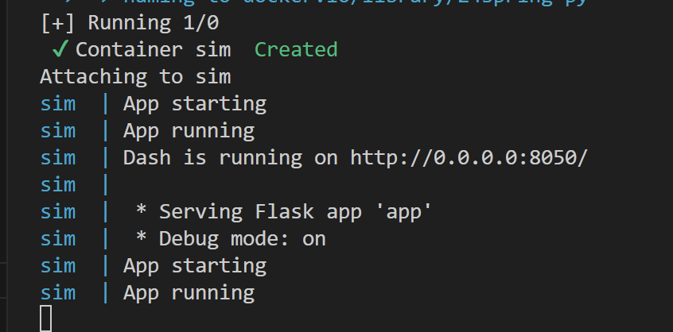
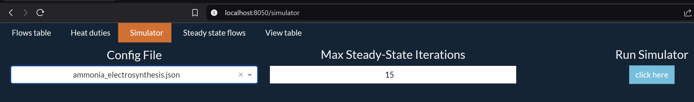
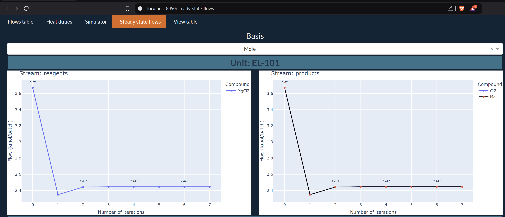
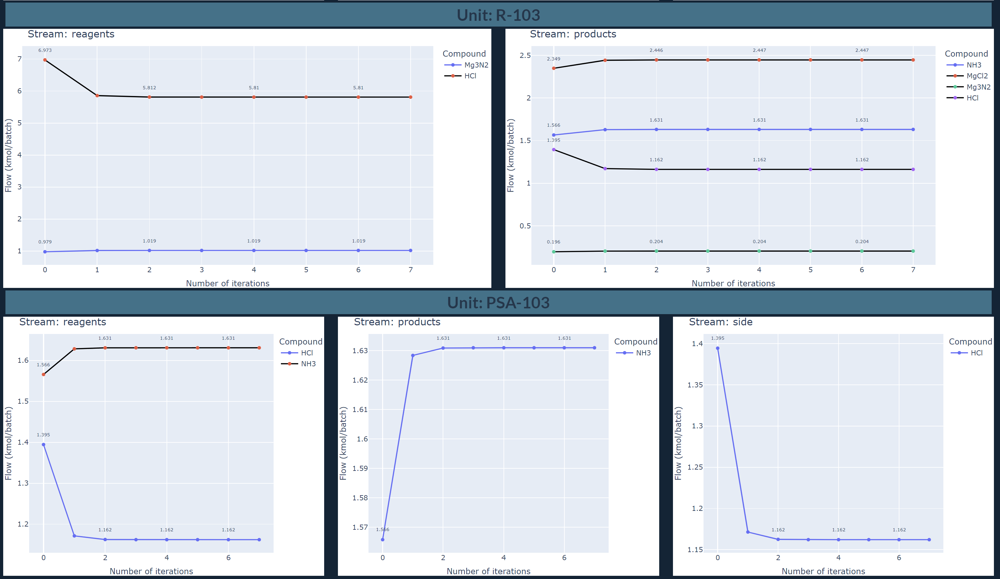
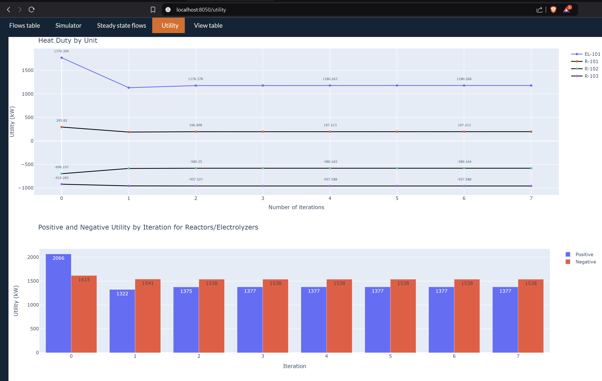
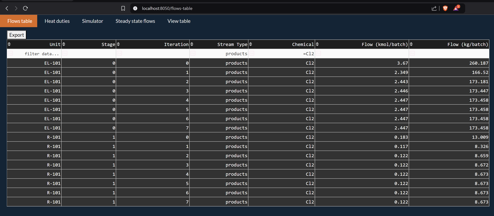
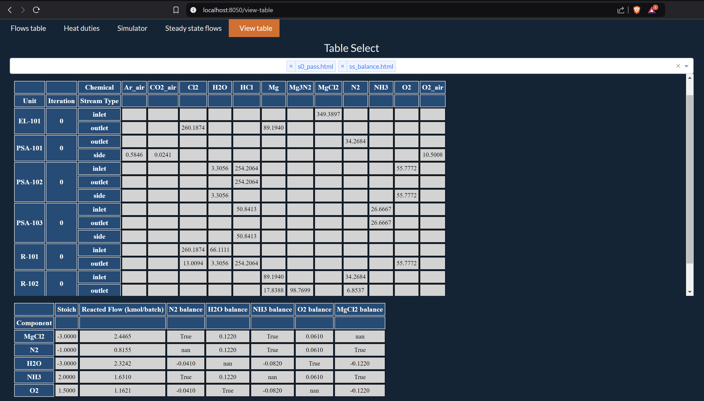

# Basic Implementation of a Chemical Process Simulator using [Thermo](https://thermo.readthedocs.io/index.html#) and [ChemPy](https://bjodah.github.io/chempy/latest/)

Simulate chemical processes by writing a [configuration file](https://github.com/hunterviolette/24spring/blob/simulator/vol/configs/ammonia_electrosynthesis.json).

## Simulator Classes

1. **[balance.py](https://github.com/hunterviolette/24spring/blob/simulator/crate/src/balance.py)**: Generates material balances to calculate initial flow rates for basis components.

2. **[core.py](https://github.com/hunterviolette/24spring/blob/simulator/crate/src/core.py)**: Iterates over current and previous state to determine the inlet and outlet flows of each unit operation.

3. **[steady_state.py](https://github.com/hunterviolette/24spring/blob/simulator/crate/src/steady_state.py)**: Iterates over state and attempts to converge flows. If flows converge, continues iterating over initial flows until steady-state flow reaches steady-state set-point.

4. **[thermal.py](https://github.com/hunterviolette/24spring/blob/simulator/crate/src/thermal.py)**: Performs thermodynamic calculations of temperature- and pressure-dependent mixtures using [cubic equations of state](https://thermo.readthedocs.io/thermo.eos_mix.html#srk-translated) to calculate the heat of reaction, and overall heat duty for adiabatic operation of reactors.

5. **[unit_registry.py](https://github.com/hunterviolette/24spring/blob/simulator/crate/src/unit_registry.py)**: Base class inherited for dimensional calculations.

## Process Flow Diagrams (PFD)



*Figure 1: PFD for overall ammonia electrosynthesis process.*




*Figure 2: Simulated ammonia electrosynthesis PFD.*

## Running the Simulator

- [Docker](https://www.docker.com/) is the only dependency.
- After installing Docker, start Docker Desktop.
- Navigate to the `24spring` directory and run:

  ```bash
  docker-compose up
  ```

  *(Windows users can double-click `run.bat`.)*


*Figure 3: Confirmation that the application is running.*

## Accessing the Simulator
Once the application is running, you can access it by visiting [http://localhost:8050/simulator](http://localhost:8050/simulator) in a web browser.

## Running Simulation

*Figure 4: The web page for running simulations.*
Select a configuration file from the `vol/configs` directory and click **Run**.

## Steady-State Flows



## Utility Usage


## Interactive Flows Table


## Static HTML Tables

